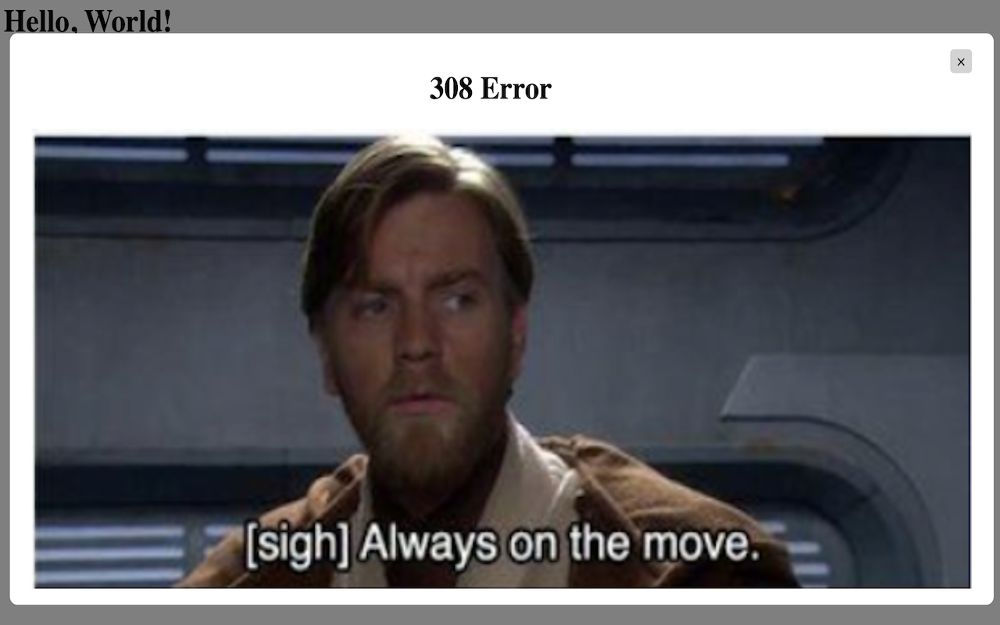

# prequel-error-codes

Change your website error codes to StarWars®™ prequel memes

## Supported Error Codes

1. 308 - Permanent Redirect
2. 400 - Bad Request
3. 403 - Forbidden
4. 404 - Not Found
5. 417 - Expectation Failed
6. 500 - Internal Server Error
7. 503 - Service Unavailable

Use this site https://httpstat.us/ to test that the error codes work. If you want other error codes, just make an issue on this repo and I'll address it.

# How to Use

## Chrome Extension Store

This extension is available on the Chrome extension store at: [Chrome Store](https://chrome.google.com/webstore/detail/prequelerrorcodes/cdjhhanfoilmkjidljiacahphcfgjbkc?hl=en).

## Sideload

You can also sideload this extension by following the following directions:

1. Go to chrome://extensions
2. Turn on developer mode
3. Download the zip for this github repo and then unzip the files
4. Go back to chrome://extensions and click on "Load Unpacked"
5. Choose the top level directory. 
6. Enjoy :) 

## Screenshot(s)

308 Error:

400 Error:

403 Error:

404 Error:

417 Error:

500 Error:

503 Error:

